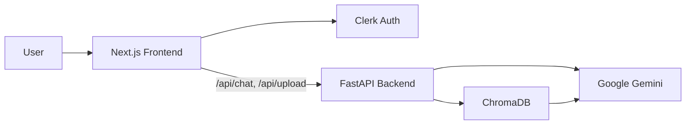

# AI Web Kit

A full-stack document chat application. Upload PDFs, ask questions in natural language, and get answers with source citations — powered by **Google Gemini**, **RAG** (retrieval-augmented generation), and **Clerk** authentication.

## Features

- **PDF upload** — drag-and-drop ingestion with chunking and vector indexing
- **RAG chat** — retrieves relevant document chunks and generates grounded answers
- **Citations** — source file and page references on each response
- **Clerk auth** — sign-in, sign-up, and protected API routes
- **Modern UI** — landing page, sidebar chat layout, settings panel

## Architecture



| Layer | Stack |
|-------|--------|
| Frontend | Next.js 16, React 19, Tailwind CSS, Clerk |
| Backend | FastAPI, LangChain, ChromaDB |
| AI | Gemini (`gemini-2.0-flash`), `models/gemini-embedding-001` |

## Project structure

```
Ai-web-kit/
├── backend/
│   ├── app/
│   │   ├── api/           # chat, upload, auth routes
│   │   ├── config/        # settings & env loading
│   │   ├── services/      # LLM, RAG, ingest
│   │   └── vectordb/      # Chroma store
│   ├── scripts/           # smoke_test.py
│   ├── requirements.txt
│   ├── start.ps1          # Windows backend starter
│   └── .env.example
├── frontend/
│   └── clerk-nextjs/      # Next.js app
│       ├── app/
│       │   ├── api/       # proxied chat & upload (auth-gated)
│       │   ├── chat/      # main chat UI
│       │   └── components/
│       └── package.json
└── .gitignore
```

## Prerequisites

- **Python 3.11+** (3.14 supported)
- **Node.js 18+** and npm
- **Google AI Studio API key** — [aistudio.google.com/apikey](https://aistudio.google.com/apikey)
- **Clerk account** — [clerk.com](https://clerk.com)

## Environment setup

### Backend (`backend/.env`)

Copy the example and fill in your key:

```powershell
cd backend
copy .env.example .env
```

```env
GOOGLE_API_KEY=your-google-api-key
GEMINI_MODEL=gemini-2.0-flash
GEMINI_EMBEDDING_MODEL=models/gemini-embedding-001
```

### Frontend (`frontend/clerk-nextjs/.env`)

```env
NEXT_PUBLIC_API_URL=http://127.0.0.1:8001
NEXT_PUBLIC_CLERK_PUBLISHABLE_KEY=pk_test_...
CLERK_SECRET_KEY=sk_test_...
NEXT_PUBLIC_CLERK_SIGN_IN_URL=/sign-in
NEXT_PUBLIC_CLERK_SIGN_UP_URL=/sign-up
```

`NEXT_PUBLIC_API_URL` must match the port your FastAPI server uses.

> **Never commit `.env` files.** They are listed in `.gitignore`. Only commit `.env.example` templates.

## Running locally

### 1. Backend

```powershell
cd backend
py -m pip install -r requirements.txt
py -m uvicorn app.main:app --reload --host 127.0.0.1 --port 8001
```

Or on Windows:

```powershell
.\start.ps1
```

Verify: [http://127.0.0.1:8001/health](http://127.0.0.1:8001/health) should return `"gemini_configured": true`.

### 2. Frontend

```powershell
cd frontend/clerk-nextjs
npm install
npm run dev
```

Open [http://localhost:3000](http://localhost:3000).

### 3. Use the app

1. Sign up or sign in
2. Go to **Chat**
3. Upload a PDF from the sidebar
4. Ask a question about the document

## API reference

| Endpoint | Method | Auth | Description |
|----------|--------|------|-------------|
| `/health` | GET | No | Service status |
| `/chat` | POST | No* | RAG query (`{"question": "..."}`) |
| `/upload` | POST | No* | PDF upload (multipart) |

\*The Next.js frontend calls `/api/chat` and `/api/upload`, which require a Clerk session before proxying to the backend.

## Smoke test

```powershell
cd backend
py scripts/smoke_test.py
```

## Troubleshooting

| Issue | Fix |
|-------|-----|
| `503` — API key missing | Save `backend/.env` and **restart** the backend |
| `401` — invalid Google key | Use a key from Google AI Studio (`AIza...` or your provider’s format) |
| Chat fails after `.env` edit | Restart uvicorn; settings reload on each request but services may be cached |
| Empty answers | Upload a PDF first; vector DB may have no documents |
| Embedding model error | Use `models/gemini-embedding-001` in `.env` |
| Port in use | `netstat -ano \| findstr :8001` then stop the old process |

## Pushing to GitHub

1. Ensure `.gitignore` is at the repo root
2. Rotate any keys that were ever committed or shared
3. `git init` → `git add .` → `git commit` → `git push`

Do not push `backend/.env`, `frontend/clerk-nextjs/.env`, `chroma_db/`, or `uploads/`.

## License

Private / unlicensed — update as needed for your use case.
